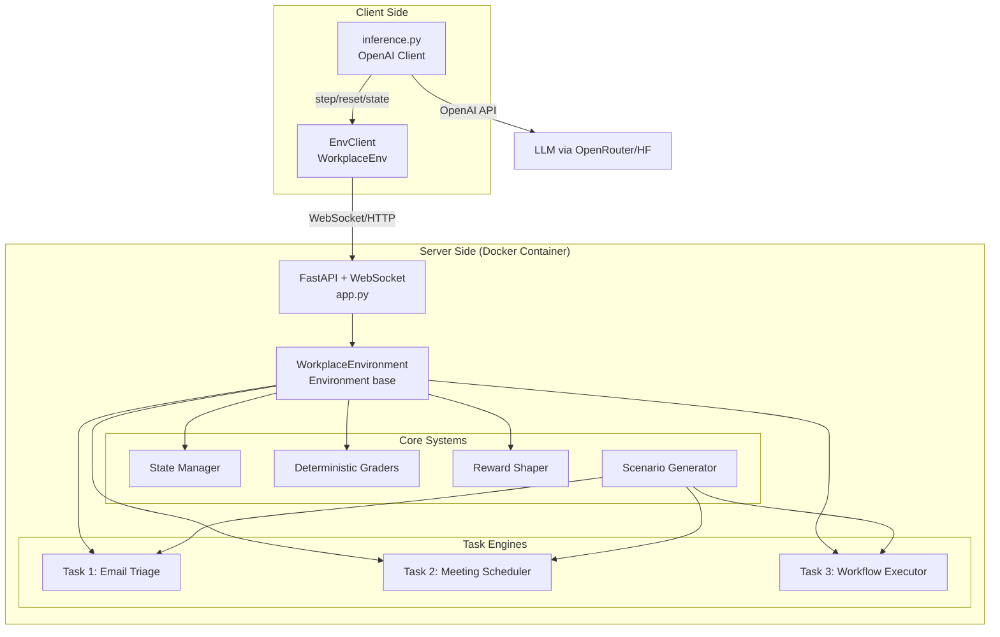
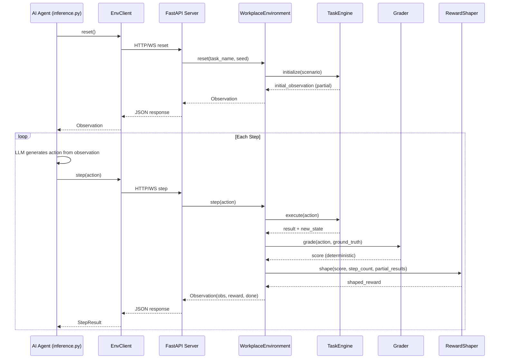

# WorkplaceAIEnv++ — System Architecture Design

## PHASE 1: Complete System Architecture

---

## 1. High-Level Overview

**WorkplaceAIEnv++** is an OpenEnv-compliant RL environment that simulates real-world workplace decision-making. An AI agent must triage emails, schedule meetings under constraints, and execute multi-step workflows — all with **partial observability**, **state memory**, and **structured action spaces**.



---

## 2. Folder Structure

```
workplace_ai_env/
├── openenv.yaml                    # OpenEnv manifest
├── pyproject.toml                  # Dependencies & package config
├── __init__.py                     # Exports: WorkplaceAction, WorkplaceObservation, WorkplaceEnv
├── models.py                       # Pydantic/dataclass models (Action, Observation, State)
├── client.py                       # WorkplaceEnv(EnvClient) implementation
├── README.md                       # Environment documentation
│
├── server/
│   ├── __init__.py
│   ├── app.py                      # FastAPI application (create_app)
│   ├── workplace_environment.py    # Main Environment class (reset, step, state)
│   ├── requirements.txt            # Docker dependencies
│   └── Dockerfile                  # Container image definition
│
├── tasks/
│   ├── __init__.py
│   ├── base_task.py                # Abstract base class for all tasks
│   ├── email_triage.py             # Task 1: Email classification + priority
│   ├── meeting_scheduler.py        # Task 2: Constraint-based scheduling
│   └── workflow_executor.py        # Task 3: Multi-step workflow execution
│
├── graders/
│   ├── __init__.py
│   ├── base_grader.py              # Abstract grader interface
│   ├── email_grader.py             # Deterministic grader for Task 1
│   ├── scheduling_grader.py        # Deterministic grader for Task 2
│   └── workflow_grader.py          # Deterministic grader for Task 3
│
├── rewards/
│   ├── __init__.py
│   └── reward_shaper.py            # Reward engineering with partial credit
│
├── scenarios/
│   ├── __init__.py
│   ├── scenario_generator.py       # Deterministic scenario generation (seeded)
│   ├── email_scenarios.py          # Email datasets (10+ scenarios)
│   ├── meeting_scenarios.py        # Meeting constraint sets
│   └── workflow_scenarios.py       # Multi-step workflow scenarios
│
├── tests/
│   ├── __init__.py
│   ├── test_environment.py         # Integration tests
│   ├── test_email_triage.py        # Task 1 unit tests
│   ├── test_meeting_scheduler.py   # Task 2 unit tests
│   ├── test_workflow_executor.py   # Task 3 unit tests
│   ├── test_graders.py             # Grader determinism tests
│   └── test_rewards.py             # Reward function tests
│
└── outputs/                        # Runtime outputs (gitignored)
    ├── logs/
    └── evals/

# Root-level files (outside the env package)
inference.py                        # CRITICAL: Inference pipeline script
.env.example                        # Environment variable template
.gitignore
.dockerignore
```

---

## 3. Data Flow Architecture



---

## 4. Model Definitions (Action / Observation / State)

### 4.1 Action Space Design

The action space is **structured** — the agent must produce specific JSON fields, not free-form text.

```python
@dataclass
class WorkplaceAction(Action):
    """Structured action for all workplace tasks."""
    task_name: str              # "email_triage" | "meeting_scheduler" | "workflow_executor"
    action_type: str            # Per-task action types (see below)
    payload: dict               # Structured parameters for the action
```

**Per-Task Action Types:**

| Task | action_type | payload fields |
|------|------------|----------------|
| **Email Triage** | `classify_email` | `email_id: str, category: "urgent"\|"normal"\|"spam", priority: float (0-1)` |
| **Meeting Scheduler** | `propose_slot` | `meeting_id: str, slot: {"day": str, "start": str, "end": str}, room: str` |
| **Meeting Scheduler** | `resolve_conflict` | `conflict_id: str, resolution: "reschedule"\|"merge"\|"cancel", details: dict` |
| **Workflow Executor** | `extract_tasks` | `email_id: str, tasks: list[{description, priority, assignee}]` |
| **Workflow Executor** | `assign_task` | `task_id: str, assignee: str, deadline: str` |
| **Workflow Executor** | `compose_response` | `email_id: str, response_text: str, action_items: list[str]` |

### 4.2 Observation Space Design (Partial Observability)

The agent **never** sees the full ground truth. Observations reveal only what the agent needs to make the next decision.

```python
@dataclass
class WorkplaceObservation(Observation):
    """What the agent can see — intentionally incomplete."""
    task_name: str                  # Current task
    step_number: int                # Current step in this episode
    max_steps: int                  # Maximum steps allowed
    visible_data: dict              # Task-specific partial view (see below)
    available_actions: list[str]    # What actions are valid now
    feedback: str                   # Result of last action (if any)
    done: bool                      # Episode complete?
    reward: float                   # Reward from last action
    metadata: dict                  # Additional context
```

**Partial Observability by Task:**

| Task | What agent sees | What agent does NOT see |
|------|----------------|------------------------|
| **Email Triage** | Email subject, sender, body snippet (first 200 chars), timestamp | Full body, sender reputation score, historical patterns, ground truth labels |
| **Meeting Scheduler** | Participant availability (with gaps), room list, meeting requirements | Other meetings' priorities, manager preferences, optimal solution |
| **Workflow Executor** | Email thread (partial), available team members, task status board | Team member workload, skill matrix, urgency weights, full dependency graph |

### 4.3 State Design (Full Internal State)

```python
@dataclass
class WorkplaceState(State):
    """Full internal state — NOT exposed to agent."""
    # OpenEnv required
    episode_id: str
    step_count: int
    
    # Task tracking
    task_name: str
    scenario_id: str
    seed: int
    
    # Ground truth (hidden from agent)
    ground_truth: dict              # Correct answers for grading
    
    # Progress tracking
    actions_taken: list[dict]       # History of all actions
    partial_scores: list[float]     # Score per action
    total_reward: float
    
    # Task-specific state
    task_state: dict                # Internal task data
```

---

## 5. Task Specifications (Detailed)

### 5.1 Task 1: Email Triage (Easy) — 1 step

**Objective:** Classify a batch of 5 emails and assign priority scores.

**Scenario Structure:**
```python
{
    "emails": [
        {
            "id": "email_001",
            "from": "ceo@company.com",
            "subject": "URGENT: Board meeting tomorrow",
            "body_snippet": "We need to finalize the Q3 report before...",
            "timestamp": "2024-03-15T09:00:00Z",
            "has_attachment": True
        },
        # ... 4 more emails
    ]
}
```

**Ground Truth (hidden):**
```python
{
    "email_001": {"category": "urgent", "priority": 0.95},
    "email_002": {"category": "normal", "priority": 0.4},
    "email_003": {"category": "spam",   "priority": 0.05},
    # ...
}
```

**Agent flow:** Agent sees 5 emails → classifies each → single action with all classifications → graded.

**Max steps:** 5 (one classify action per email)

---

### 5.2 Task 2: Meeting Scheduler (Medium) — Multi-step with constraints

**Objective:** Schedule 3 meetings into a weekly calendar respecting hard constraints.

**Constraints:**
- No time overlap for same participant
- Room capacity must match group size
- Some participants have blocked hours
- Priority meetings get preferred slots
- At least 30-min buffer between meetings for each person

**Scenario Structure:**
```python
{
    "meetings": [
        {
            "id": "mtg_001",
            "title": "Product Review",
            "duration_minutes": 60,
            "participants": ["alice", "bob", "charlie"],
            "priority": "high",
            "preferred_time": "morning"
        },
        # ... 2 more meetings
    ],
    "participants": {
        "alice": {"blocked": [("Mon", "09:00", "10:00"), ("Wed", "14:00", "16:00")]},
        "bob":   {"blocked": [("Tue", "all_day")]},
        # ...
    },
    "rooms": [
        {"id": "room_a", "capacity": 4},
        {"id": "room_b", "capacity": 8},
        {"id": "room_c", "capacity": 2}
    ],
    "available_slots": ["Mon 09:00-17:00", "Tue 09:00-17:00", ...]
}
```

**Agent flow:** 
1. Agent sees constraints → proposes slot for meeting 1 → gets feedback
2. Agent sees updated calendar → proposes slot for meeting 2 → gets feedback
3. Agent sees updated calendar → proposes slot for meeting 3 → gets feedback
4. If conflicts → agent must resolve them → gets feedback

**Max steps:** 8

---

### 5.3 Task 3: Workflow Executor (Hard) — Multi-step with state memory

**Objective:** Given an email thread, extract action items, prioritize, assign to team, and compose a response.

**Scenario Structure:**
```python
{
    "email_thread": [
        {
            "id": "thread_001_msg_1",
            "from": "client@external.com",
            "to": "team@company.com",
            "subject": "Project Alpha - Deliverables Update",
            "body": "Hi team, we need the following by Friday: ...",
            "timestamp": "2024-03-14T10:00:00Z"
        },
        # ... follow-up messages
    ],
    "team_members": [
        {"name": "alice", "role": "developer", "current_tasks": 3},
        {"name": "bob", "role": "designer", "current_tasks": 1},
        {"name": "charlie", "role": "pm", "current_tasks": 2}
    ],
    "task_board": {
        "in_progress": ["Task A", "Task B"],
        "blocked": ["Task C"]
    }
}
```

**Agent flow (4 mandatory steps):**
1. `extract_tasks` — Parse email thread → identify action items
2. `prioritize_tasks` — Order by urgency/importance (agent must output ranking)
3. `assign_task` (×N) — Assign each task to a team member considering workload
4. `compose_response` — Write a professional response summarizing actions taken

**Max steps:** 10

---

## 6. Reward Strategy

### 6.1 Reward Shaping Philosophy

Rewards are **dense** (per-step) and **deterministic** (same input → same score).

```
Total Reward = Σ(step_reward × step_weight) + completion_bonus + efficiency_bonus
```

### 6.2 Per-Task Reward Breakdown

#### Task 1: Email Triage
| Component | Weight | Scoring |
|-----------|--------|---------|
| Category accuracy | 0.5 | Exact match: 1.0, Wrong: 0.0 |
| Priority score | 0.3 | 1.0 - abs(predicted - actual), min 0 |
| Batch consistency | 0.2 | Relative ordering correct: Kendall's τ normalized to [0, 1] |
| **Max per email** | **1.0** | |

#### Task 2: Meeting Scheduler
| Component | Weight | Scoring |
|-----------|--------|---------|
| No constraint violations | 0.4 | 1.0 if valid, 0.0 per violation |
| Preference satisfaction | 0.3 | Time preference match: 0-1 |
| Conflict resolution quality | 0.2 | Optimal resolution: 1.0, suboptimal: 0.5, invalid: 0.0 |
| Buffer compliance | 0.1 | 30-min buffer maintained: 1.0/0.0 per pair |
| **Completion bonus** | **+0.5** | All meetings scheduled validly |

#### Task 3: Workflow Executor
| Component | Weight | Scoring |
|-----------|--------|---------|
| Task extraction (recall) | 0.25 | (Correct tasks found) / (Total ground truth tasks) |
| Task extraction (precision) | 0.10 | (Correct tasks found) / (Tasks agent identified) |
| Priority ordering | 0.15 | Kendall's τ correlation with ground truth order |
| Assignment quality | 0.25 | Role match: 0.5, workload balance: 0.3, deadline feasibility: 0.2 |
| Response quality | 0.25 | Action items mentioned: 0.5, professional tone: 0.3, completeness: 0.2 |
| **Completion bonus** | **+1.0** | All 4 steps completed successfully |

### 6.3 Efficiency Bonus
```python
efficiency_bonus = max(0, (max_steps - steps_used) / max_steps) * 0.2
```

---

## 7. Deterministic Grader Design

Every grader produces the **exact same output** given the **exact same input**. No randomness, no LLM calls.

```python
class BaseGrader(ABC):
    """All graders are deterministic functions."""
    
    @abstractmethod
    def grade(self, action: dict, ground_truth: dict, state: dict) -> GradeResult:
        """Returns GradeResult with score in [0,1] and detailed breakdown."""
        pass

@dataclass
class GradeResult:
    score: float            # 0.0 to 1.0
    breakdown: dict         # Per-component scores
    feedback: str           # Human-readable explanation
    is_valid: bool          # Whether action was structurally valid
```

**Grading is fully rule-based:**
- String matching for categories
- Numerical distance for priority scores
- Constraint satisfaction checking for scheduling
- Set intersection for task extraction
- Keyword presence for response quality

---

## 8. Inference Pipeline Design

```
inference.py
├── Reads: API_BASE_URL, MODEL_NAME, HF_TOKEN from env
├── Uses: OpenAI client (chat completions)
├── Connects to: WorkplaceEnv (running locally or on HF Spaces)
├── Output format: STRICT stdout format (see below)
```

**Output Format (exact):**
```
[START] task=email_triage env=workplace_ai_env model=meta-llama/Llama-3-8B-Instruct
[STEP] step=1 action=classify_email reward=0.85 done=false error=null
[STEP] step=2 action=classify_email reward=0.90 done=false error=null
...
[END] success=true steps=5 rewards=0.85,0.90,...
```

---

## 9. Containerization Strategy

```dockerfile
# Standalone Dockerfile (no base image dependency)
FROM python:3.11-slim

WORKDIR /app

# Install core dependencies
COPY requirements.txt .
RUN pip install --no-cache-dir -r requirements.txt

# Copy environment code
COPY workplace_ai_env/ /app/workplace_ai_env/
COPY inference.py /app/inference.py

HEALTHCHECK --interval=30s --timeout=3s --start-period=5s --retries=3 \
    CMD curl -f http://localhost:8000/health || exit 1

EXPOSE 8000

CMD ["uvicorn", "workplace_ai_env.server.app:app", "--host", "0.0.0.0", "--port", "8000"]
```

---

## 10. openenv.yaml Manifest

```yaml
spec_version: 1
name: workplace_ai_env
type: space
runtime: fastapi
app: server.app:app
port: 8000
```

---

## 11. Implementation Phases (Execution Order)

| Phase | Description | Deliverables | Est. Time |
|-------|-------------|-------------|-----------|
| **Phase 2** | Repo Setup + Dependencies | `pyproject.toml`, folder structure, git init | 10 min |
| **Phase 3** | OpenEnv Core | `models.py`, `workplace_environment.py`, `app.py`, `client.py` | 20 min |
| **Phase 4** | Task Implementation | 3 task engines + scenario generators | 40 min |
| **Phase 5** | Reward Engineering | `reward_shaper.py` with dense rewards | 15 min |
| **Phase 6** | Deterministic Graders | 3 graders with full test coverage | 20 min |
| **Phase 7** | Inference Script | `inference.py` with strict output format | 15 min |
| **Phase 8** | Dockerization | `Dockerfile`, `docker-compose.yml` | 10 min |
| **Phase 9** | HF Deployment | Push to Hugging Face Spaces | 10 min |
| **Phase 10** | Testing + Validation | `openenv validate`, integration tests | 15 min |
| **Phase 11** | Documentation | README, API docs, architecture diagrams | 10 min |

---

## 12. Key Design Decisions

> [!IMPORTANT]
> ### Partial Observability Implementation
> The agent receives `visible_data` which is a **filtered subset** of the full state. The environment's `_mask_state()` method strips ground truth, full email bodies, and solution hints before constructing the observation.

> [!IMPORTANT]  
> ### State Memory Requirement
> Task 3 requires the agent to reference outputs from previous steps. The observation includes a `feedback` field showing results of the last action, but the agent must maintain its own context about the full conversation history (handled by the LLM's context window in inference.py).

> [!WARNING]
> ### No LLM Calls in Graders
> All graders use deterministic rule-based logic. No LLM-as-judge. This ensures reproducibility and speed. Response quality in Task 3 uses keyword matching + structural checks, not semantic similarity.

> [!TIP]
> ### Free API Strategy
> - **LLM**: OpenRouter free tier (meta-llama/Llama-3-8B-Instruct) or Hugging Face Inference API
> - **Deployment**: Hugging Face Spaces (free Docker deployment)
> - **No external APIs**: Everything runs self-contained

---

## Open Questions

> [!IMPORTANT]
> 1. **HF Token**: Do you already have a Hugging Face account + API token, or do I need to include signup steps?
> 2. **OpenRouter**: Do you have an OpenRouter API key for free LLM inference, or should I default to HF Inference API?
> 3. **Python version**: Are you using Python 3.10+ on your machine? (Required for OpenEnv)
> 4. **Docker**: Is Docker Desktop installed and running on your Windows machine?

---

## Verification Plan

### Automated Tests
```bash
# Unit tests for each task
pytest tests/ -v --tb=short

# Integration test: full episode run
pytest tests/test_environment.py -v

# OpenEnv validation
openenv validate --url http://localhost:8000
```

### Manual Verification
- Run inference.py against local server → verify output format
- Build Docker image → run container → test HTTP endpoints
- Push to HF Spaces → test remote endpoint

---

## CONTEXT SUMMARY BLOCK

```
📁 Folder Structure: Designed (see Section 2)
✅ Completed: Architecture design, data flow, action/observation/state spaces, reward strategy, grader design
⏳ Pending: All implementation phases (2-11)
🔑 Key Configs: openenv.yaml (spec_version 1), Python 3.11, FastAPI + uvicorn
🏗️ Architecture: Monolithic env package with task/grader/reward submodules
🎯 Core Pattern: Environment → TaskEngine → Grader → RewardShaper → Observation
```
